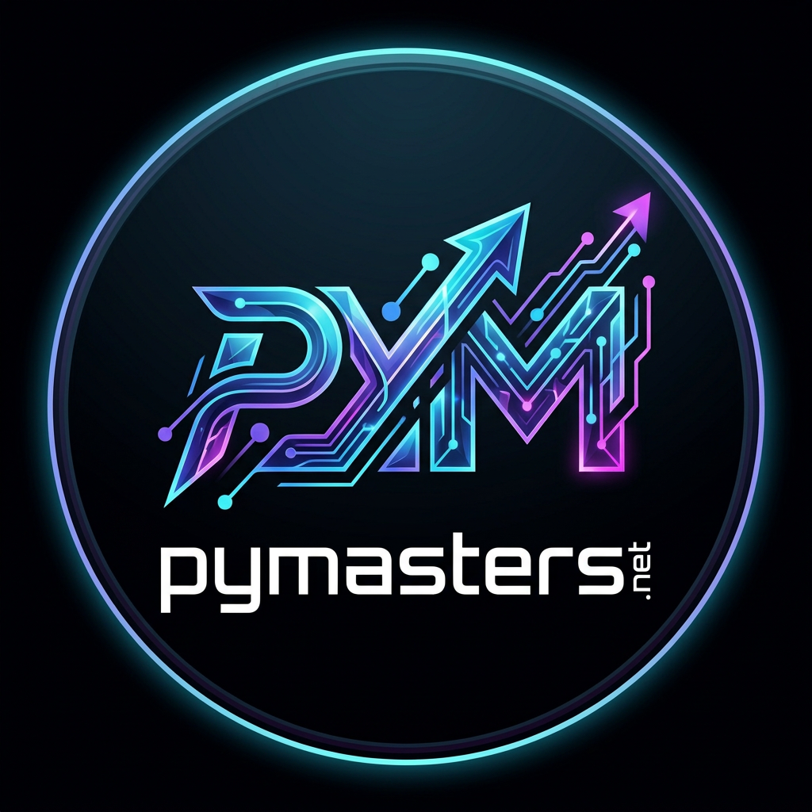

# PyMasters

**Master Python, AI, and cloud engineering — interactively, at your own pace, in your own language.**

### 🚀 [Start learning free at pymasters.net](https://www.pymasters.net)

---

## What is PyMasters?

PyMasters is an interactive learning platform that teaches Python and modern AI engineering the way it should be taught: **by doing**. No videos to sit through, no walls of text — every lesson is a hands-on experience where concepts come alive as you scroll, code runs right in your browser, and a personal AI tutor is always one click away.

Whether you're writing your first `print()` or architecting multi-cloud AI systems, there's a track for you — **430+ lessons** and counting.

## ✨ Features

### 📖 Lessons that explain themselves
Forget static tutorials. PyMasters lessons use **scroll-synchronized visualizations** — as you read, animated diagrams step through exactly what the code is doing: variables changing, loops iterating, neural networks learning. Complex ideas become something you can *see*.

### 💻 Code without leaving the page
Every lesson has runnable code, and the built-in **Playground** gives you a full Python editor with real execution — write, run, and experiment instantly. Need a library? Install packages on demand. No setup, no installs, no "works on my machine."

### 🧑‍🏫 Vaathiyaar — your personal AI tutor
Stuck on a concept? **Vaathiyaar** (Tamil for *teacher*) is available throughout the app and understands exactly which lesson you're on. Ask it to re-explain, simplify, give another example, or debug your code — like having a patient mentor on call, 24/7.

### 🏆 Challenges that check your work
Put your skills to the test with **auto-graded coding challenges**. Get instant feedback, track your streaks and progress, and revisit past challenges from the archive. Your work autosaves as you go.

### 🌏 Learn in your language
PyMasters speaks **8 languages** — including Tamil, Hindi, and more. Lessons translate on demand, and Vaathiyaar tutors you in whichever language you're most comfortable thinking in.

### 🔍 Find exactly what you need
**Smart semantic search** understands what you mean, not just what you type. Search "how do I stop my loop running forever" and land on the right lesson — plus related-lesson suggestions to keep your momentum going.

### 🎓 Structured learning tracks

| Track | What you'll master |
|---|---|
| 🐍 **Python Fundamentals** | Variables to OOP — a complete foundation |
| 🧮 **Data Structures & Algorithms** | Interview-ready DSA with visual walkthroughs |
| 🌐 **Web Development** | FastAPI, Django, Flask, and REST APIs |
| 🤖 **Machine Learning & Deep Learning** | From linear regression to transformers |
| 🧠 **AI Engineering** | LLMs, RAG, agents, prompt engineering, local models |
| ☁️ **Cloud & Enterprise AI** | AWS, Azure, GCP, and multi-cloud architecture |

### 👥 For teams and institutions
Running a classroom or training a team? PyMasters supports **organization accounts** with member management and progress visibility — plus easy sign-in with GitHub or LinkedIn.

### ♿ Built for everyone
Light and dark themes, reduced-motion support, screen-reader-friendly announcements, and shareable lesson links — learning should never have barriers.

## 🚀 Getting started

1. Visit **[pymasters.net](https://www.pymasters.net)**
2. Create a free account (or continue with GitHub / LinkedIn)
3. Pick a track and start coding — right in your browser

That's it. No downloads, no environment setup, no credit card.

---

Copyright © 2026 PyMasters ([pymasters.net](https://www.pymasters.net)). All rights reserved. See [LICENSE](LICENSE).

